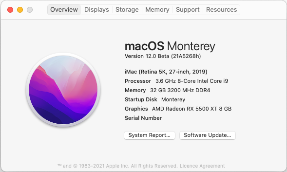

# Opencore config
Personal configuration files for [OpenCore](https://github.com/acidanthera/OpenCorePkg).
Current release **0.7.7**

## Kexts

Version | Name
------------ | -------------
2.1.3 | [AirportBrcmFixup.kext](https://github.com/acidanthera/AirportBrcmFixup)
1.6.7 | [AppleALC.kext](https://github.com/acidanthera/AppleALC)
1.0.7 |[IntelMausi.kext](https://github.com/acidanthera/IntelMausi)
1.5.8 | [Lilu.kext](https://github.com/acidanthera/Lilu)
1.2.8 | [VirtualSMC.kext](https://github.com/acidanthera/VirtualSMC)
1.5.5 | [WhateverGreen.kext](https://github.com/acidanthera/WhateverGreen)

## Hardware

Name | Model
------------ | -------------
**Mobo**  | Asus ROG STRIX Z390-I GAMING
**CPU** | Intel Core i9-9900k 9th Gen 8 Core CPU 3.6 GHz
**GPU**  | Radeon RX 5500 XT 8 GB
**WiFi**  | BCM94360NG NGFF M.2 802.11AC
**SSD** | 1TB Samsung 970 EVO PLUS Internal M.2
**RAM** | Corsair Vengeance LPX 32 GB (2 x 16 GB) DDR4 3200 MHz C16 XMP PC4-25600